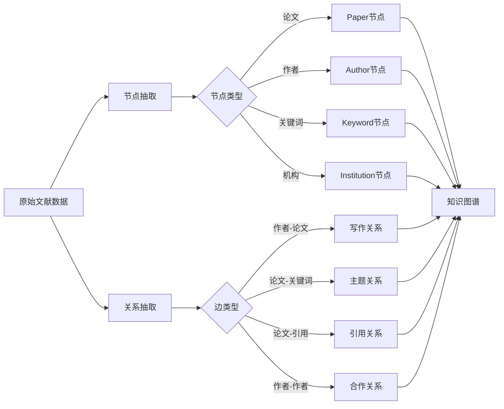

# LLM多智能体研究领域知识图谱数据模型设计

## 1. 模型概述

### 1.1 设计目标

本数据模型用于构建LLM多智能体研究领域的知识图谱，旨在：
- 揭示研究主题之间的语义关联
- 展现学者合作网络结构
- 追踪知识传播路径（引用关系）
- 支持领域演化分析

### 1.2 模型范围

| 维度 | 内容 |
|------|------|
| 节点类型 | 论文、作者、机构、关键词、研究领域 |
| 边类型 | 作者-论文、机构-作者、论文-关键词、论文-引用、关键词-共现 |
| 时间范围 | 2020-2026年 |

---

## 2. 节点定义

### 2.1 论文节点 (Paper)

| 属性 | 类型 | 说明 | 示例 |
|------|------|------|------|
| id | string | Lens ID | "001-207-880-800-633" |
| title | string | 论文标题 | "A Framework for Automation..." |
| year | int | 发表年份 | 2025 |
| type | string | 文献类型 | "journal article" |
| source | string | 期刊/会议名称 | "Current directions in psychological science" |
| citations | int | 被引次数 | 45 |
| open_access | bool | 是否开放获取 | true |

### 2.2 作者节点 (Author)

| 属性 | 类型 | 说明 | 示例 |
|------|------|------|------|
| id | string | 作者名称（去重后） | "Zac E Imel" |
| paper_count | int | 发表论文数 | 5 |
| citation_count | int | 总被引次数 | 230 |

### 2.3 机构节点 (Institution)

| 属性 | 类型 | 说明 | 示例 |
|------|------|------|------|
| id | string | 机构/国家名称 | "United States" |
| paper_count | int | 发表论文数 | 156 |

### 2.4 关键词节点 (Keyword)

| 属性 | 类型 | 说明 | 示例 |
|------|------|------|------|
| id | string | 关键词（小写标准化） | "multi-agent system" |
| frequency | int | 出现频次 | 42 |

### 2.5 研究领域节点 (Field)

| 属性 | 类型 | 说明 | 示例 |
|------|------|------|------|
| id | string | 研究领域名称 | "Computer science" |
| paper_count | int | 相关论文数 | 203 |

---

## 3. 边定义

### 3.1 作者-论文边 (Author-Paper)

| 属性 | 类型 | 说明 |
|------|------|------|
| weight | int | 作者贡献度（默认1） |
| position | int | 作者排名 |

### 3.2 机构-作者边 (Institution-Author)

| 属性 | 类型 | 说明 |
|------|------|------|
| weight | int | 合作频次 |

### 3.3 论文-关键词边 (Paper-Keyword)

| 属性 | 类型 | 说明 |
|------|------|------|
| weight | float | 相关性权重（TF-IDF） |

### 3.4 论文-引用边 (Paper-Citation)

| 属性 | 类型 | 说明 |
|------|------|------|
| year | int | 引用年份 |

### 3.5 关键词-共现边 (Keyword-Cooccurrence)

| 属性 | 类型 | 说明 |
|------|------|------|
| weight | int | 共现频次 |
| pmi | float | 点互信息值 |

---

## 4. 权重计算逻辑

### 4.1 关键词共现权重

```
weight(i,j) = 同时包含关键词i和j的论文数
pmi(i,j) = log2( P(i,j) / (P(i) * P(j)) )
```

### 4.2 作者合作权重

```
weight(a1,a2) = a1和a2共同发表的论文数
```

### 4.3 引用权重

```
weight(p1,p2) = p1引用p2的次数（通常为1）
```

---

## 5. 网络构建流程



---

## 6. 数据模型约束

| 约束类型 | 说明 |
|----------|------|
| 唯一性 | 每个节点ID唯一 |
| 完整性 | 论文必须有标题和年份 |
| 一致性 | 作者名称格式统一 |
| 时效性 | 引用关系反映实际引用情况 |

---

## 7. 扩展说明

### 7.1 可扩展节点类型

- 基金项目节点
- 研究主题聚类节点
- 会议节点

### 7.2 可扩展边类型

- 基金-论文资助关系
- 主题-主题语义关系
- 会议-论文收录关系