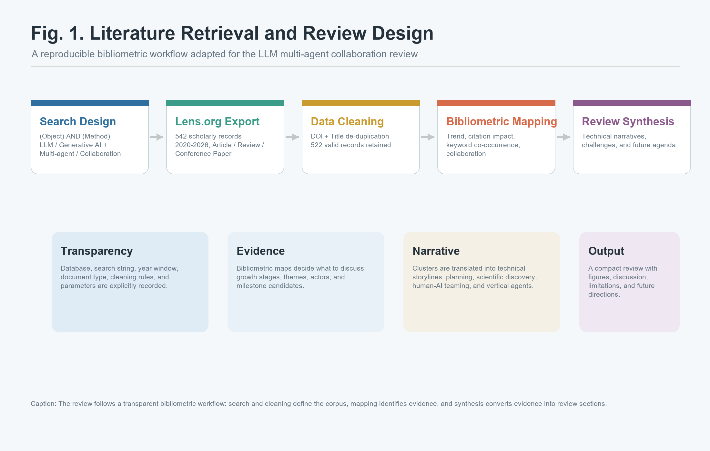
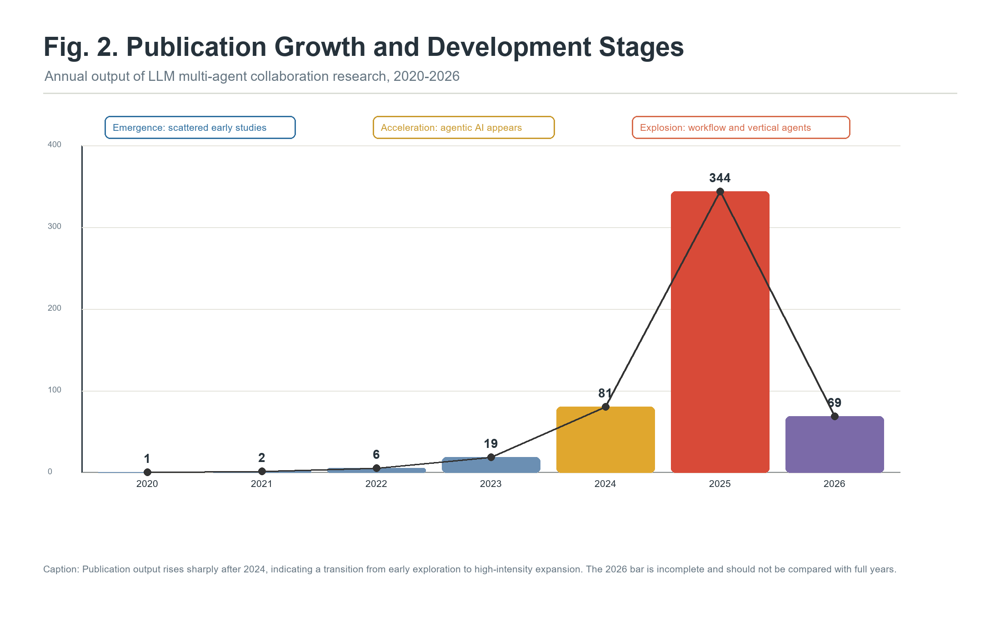
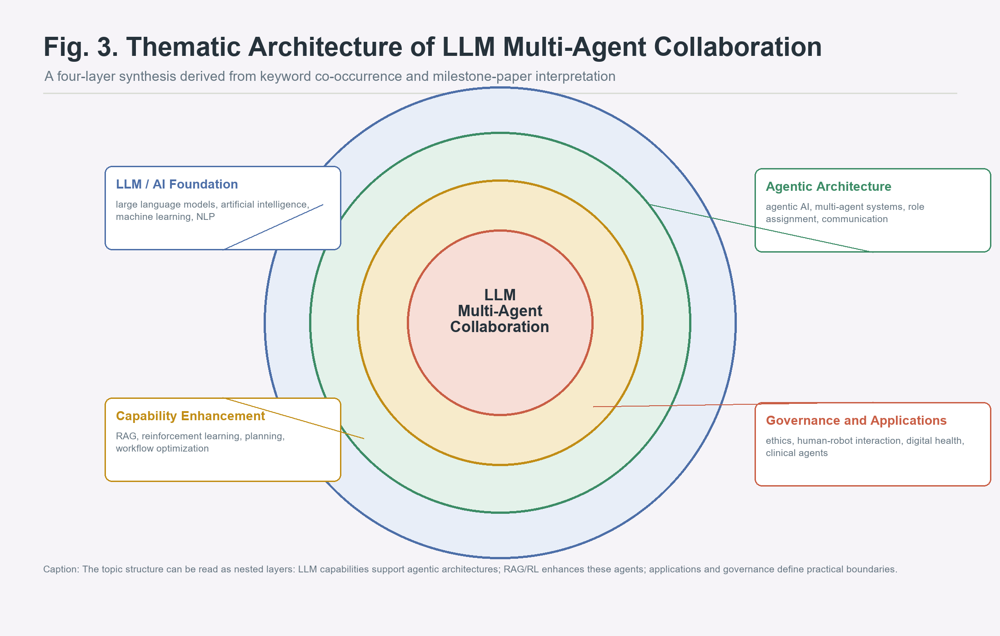
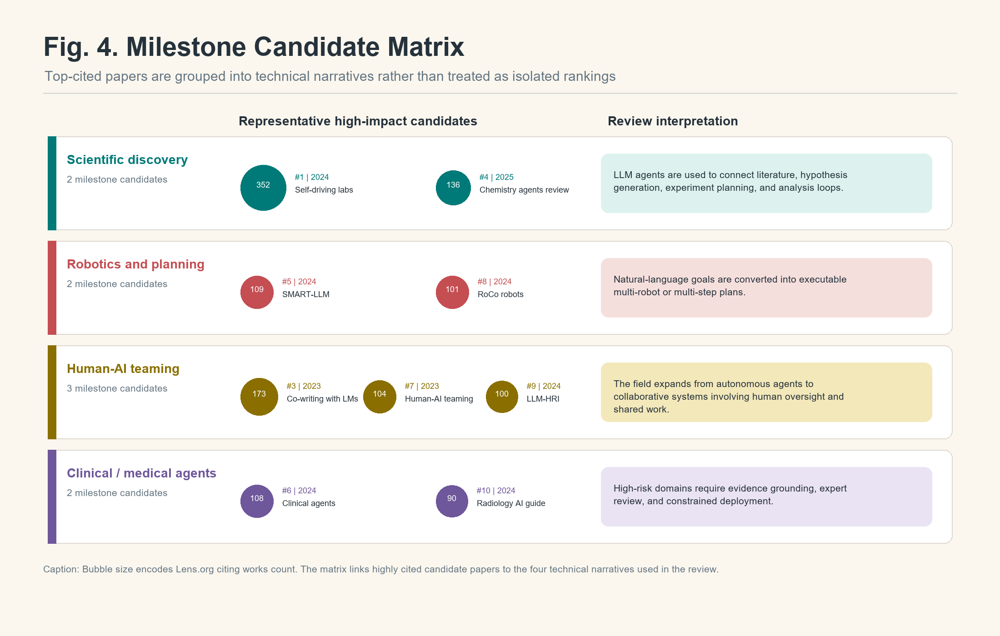
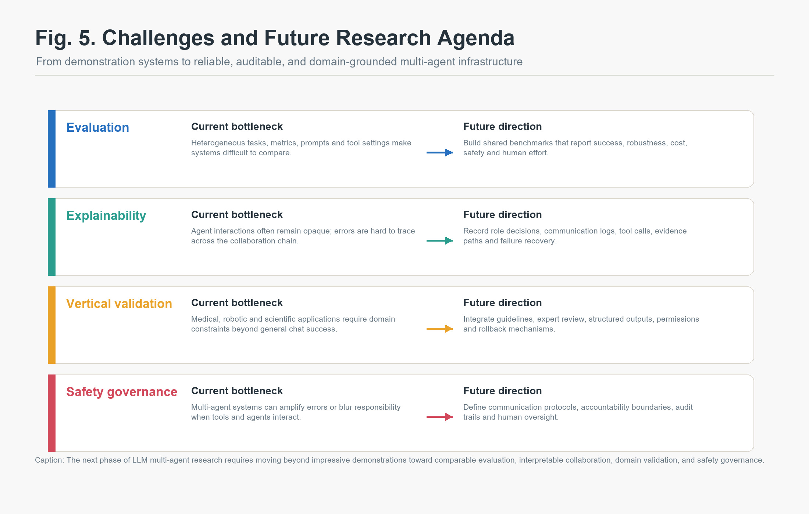

# 大语言模型多智能体协作研究的文献计量综述：从智能体框架到垂直场景落地

## 摘要

大语言模型（Large Language Models, LLMs）的快速发展正在推动人工智能系统从单模型问答与文本生成，转向具备任务分解、工具调用、角色协作和复杂工作流执行能力的多智能体系统。为系统把握 LLM 多智能体协作研究的知识结构与前沿趋势，本文基于 Lens.org Scholarly Works 构建了 2020-2026 年相关文献数据集，经 DOI 与标题去重后获得 522 篇有效文献。本文采用文献计量学方法分析年度发文趋势、被引影响力、关键词共现、作者合作、国家/地区分布和高被引 milestone 候选论文，并在此基础上提炼技术叙事线。结果显示，该领域在 2024-2025 年进入快速爆发期，2025 年发文量达到 344 篇；样本总被引次数为 4,265 次，h 指数为 31；关键词结构显示研究主题主要集中在 LLM/AI 技术底座、智能体协作架构、RAG/RL 能力增强以及治理与垂直应用四个层次。结合高被引论文和主题图谱，本文将该领域归纳为四条主要技术主线：多智能体任务规划与自动化工作流、科学发现与自驱动实验室、人机协作与人类监督、医疗和机器人等垂直行业智能体。最后，本文讨论评价体系不统一、协作过程可解释性不足、垂直场景验证有限以及安全治理复杂化等挑战，并提出未来研究方向。

**关键词**：大语言模型；多智能体系统；文献计量学；科学知识图谱；智能体协作；前沿趋势追踪

## 1. 引言

大语言模型已经从对话式文本生成工具逐步演化为能够参与复杂任务处理的智能系统组件。早期 LLM 应用主要集中在问答、摘要、翻译、写作辅助和代码生成等单模型任务中；随着工具调用、检索增强生成（Retrieval-Augmented Generation, RAG）、长上下文推理和函数调用能力的发展，LLM 开始被嵌入更复杂的工作流中，承担规划、检索、执行、评估和反思等角色。在这一背景下，多智能体协作成为 LLM 研究的重要方向。

与单一 LLM 系统相比，多智能体系统的核心思想是通过角色分工和交互协作提升复杂任务处理能力。例如，在软件开发场景中，不同智能体可以分别负责需求分析、架构设计、代码生成、测试和审查；在机器人场景中，语言模型可以作为高层规划器，将自然语言目标转化为多个机器人或多个执行模块之间的协作计划；在科学发现中，智能体系统可以参与文献检索、假设生成、实验设计、数据分析和报告撰写。由此可见，LLM 多智能体协作并不是简单地"增加几个模型"，而是涉及任务组织方式、系统架构和人机关系的变化。

这一变化也使综述写作面临新的困难。一方面，LLM 多智能体研究增长速度很快，新概念、新框架和新应用密集出现；另一方面，该领域横跨人工智能、机器人、软件工程、医疗健康、化学实验室自动化、人机交互和安全治理等多个方向，单纯依靠人工经验挑选文献容易造成主题偏差。文献计量学能够从大规模文献数据中识别发文趋势、关键词结构、合作网络和高影响力论文，为综述的章节组织提供证据支持。

本文参考文献计量型综述的基本写法：首先建立可复现数据集和检索口径，其次用计量结果识别领域阶段、主题结构和代表性论文，再将图谱证据转化为技术叙事，最后讨论挑战与未来方向。本文的综述框架如图 1 所示。

**图 1 文献检索与综述设计流程。** 本文首先构建 Lens.org 文献数据集，随后进行去重、计量分析和主题映射，最后将计量证据转化为综述中的技术叙事线与未来研究议程。

## 2. 数据来源与研究方法

### 2.1 数据来源与检索式设计

本文数据来自 Lens.org Scholarly Works。考虑到研究对象是 LLM 与多智能体协作的交叉领域，检索式采用 `(Object) AND (Method)` 的布尔逻辑。其中 Object 词组用于限定大语言模型和生成式人工智能相关对象，包括 `Large Language Model*`、`LLM*`、`Generative AI`、`Foundation Model*` 和 `ChatGPT`；Method 词组用于限定多智能体和协作机制，包括 `Multi-agent*`、`Collaboration`、`Coordination`、`Cooperation` 和 `Multi-agent system*`。

检索时间范围设定为 2020-2026 年，文献类型包括 Article、Review 和 Conference Paper，语言限定为 English。之所以选择 2020 年作为起点，是因为该时期前后大规模预训练语言模型开始进入快速发展阶段，而 2023 年以后智能体框架和工具调用能力明显升温。该时间窗既能覆盖早期萌芽研究，也能捕捉 2024-2025 年的快速增长。

原始检索获得 542 条记录。为降低重复记录对计量结果的影响，本文按 DOI 去重，并进一步按标题去重，最终获得 522 篇有效文献。清洗后数据中，Title 和 Publication Year 字段覆盖率为 100%，Abstract 字段覆盖率为 98.28%，References 字段覆盖率为 81.99%。这些字段能够支持年度趋势、关键词共现、作者合作、引用网络和 milestone 候选论文识别等分析。

### 2.2 文献计量分析流程

本文使用 Python 对数据进行清洗、统计和可视化。分析流程包括六个部分。

第一，年度发文趋势分析。通过统计不同年份的发文量，判断 LLM 多智能体协作研究的发展阶段，并识别快速增长的时间窗口。

第二，影响力指标分析。本文统计总被引次数、篇均被引、被引中位数、高被引论文数、零被引论文数和 h 指数，用于判断该领域的学术关注度和引用分布特征。

第三，关键词共现分析。关键词共现能够揭示研究主题之间的关联。为避免同一篇论文中重复关键词导致自连边，本文在单篇文献内部先对关键词进行标准化和去重，再计算关键词对共现关系。

第四，作者合作与国家/地区分布分析。作者合作网络用于观察研究团队是否已经形成稳定核心群体；国家/地区分布用于识别研究力量的空间结构和数据字段缺失情况。

第五，高被引 milestone 候选论文分析。本文根据 Lens.org 的 Citing Works Count 排序，选择 Top 10 高被引论文作为第一轮 milestone 候选，并结合主题内容将其归入不同技术叙事线。

第六，参数敏感性分析。本文对关键词共现阈值、作者合作阈值、时间窗口和节点过滤进行敏感性测试，以避免阈值选择完全依赖主观经验。

## 3. 文献计量结果

### 3.1 年度发文趋势与领域阶段

年度发文量显示，LLM 多智能体协作研究具有明显的阶段性增长特征。2020 年仅 1 篇，2021 年 2 篇，2022 年 6 篇，2023 年 19 篇，2024 年增长至 81 篇，2025 年进一步达到 344 篇。2026 年已有 69 篇，但由于年份尚未结束，该数值不能与完整年份直接比较。

**图 2 年度发文增长与发展阶段。** 2020-2023 年为早期探索阶段，2024 年开始加速，2025 年进入爆发式增长阶段。2026 年数据尚未覆盖全年，因此仅作为阶段性观察。

从图 2 可以看出，该领域并非线性增长，而是在 2024 年后出现明显跃迁。2020-2023 年的论文数量较少，说明该时期 LLM 多智能体研究仍处于概念探索和早期框架阶段。2024 年发文量增长至 81 篇，表明 agentic AI、RAG、工具调用和自动化工作流开始成为独立研究热点。2025 年的 344 篇文献则显示该领域已进入高强度扩张期。

影响力指标进一步支持这一判断。522 篇文献总被引次数为 4,265 次，篇均被引 8.17 次，被引中位数为 1.00 次，h 指数为 31。零被引论文数为 236 篇，占比约 45.2%。这种结构说明领域整体关注度较高，但大量新近论文尚未经历完整引用周期。换言之，LLM 多智能体协作已经形成研究热度，但知识基础仍在快速重组。

### 3.2 关键词结构与研究主题

关键词统计显示，最高频关键词包括 `artificial intelligence`、`large language models`、`large language model`、`machine learning`、`natural language processing`、`deep learning`、`generative ai`、`agentic ai`、`chatgpt`、`reinforcement learning`、`ethics`、`multi-agent systems`、`retrieval-augmented generation` 和 `ai agents`。这些关键词并非孤立出现，而是构成了一个由技术底座、系统架构、能力增强和应用治理组成的多层结构。

**图 3 LLM 多智能体协作研究的主题架构。** 关键词共现结果可归纳为四个层次：LLM/AI 技术底座、智能体协作架构、RAG/RL 能力增强、治理与应用场景。

第一层是 LLM/AI 技术底座。`large language models`、`artificial intelligence`、`machine learning` 和 `natural language processing` 构成了该领域的基础概念。这说明多智能体系统的能力仍然依赖大模型本身的语言理解、生成、推理和知识表达能力。

第二层是智能体协作架构。`agentic ai`、`multi-agent systems` 和 `ai agents` 等关键词反映出研究重点正在从单模型输出转向系统层面的角色分配、任务拆解、消息传递、协作协议和多轮反思。

第三层是能力增强方法。`retrieval-augmented generation` 和 `reinforcement learning` 的出现说明研究者正在尝试解决 LLM 智能体的知识更新、长期规划和反馈学习问题。RAG 可以为智能体提供外部证据，强化学习则可能提升智能体在交互环境中的策略优化能力。

第四层是治理与应用场景。`ethics`、`human-robot interaction` 和 `digital health` 等关键词表明，多智能体系统已经进入需要安全控制、人类监督和责任分配的实际应用环境。也就是说，该领域的核心问题正在从"能不能完成任务"转向"能不能可靠、透明、可控地完成任务"。

### 3.3 研究力量与学科分布

作者统计显示，样本涉及 2,564 名作者，篇均作者数为 5.07。高产作者最高发文量仅为 3 篇，说明该领域尚未形成高度集中的核心作者群体。作者合作网络在过滤一次性合作后，仅保留若干小规模合作组件，表明当前研究仍以小团队和项目型合作为主。

来源期刊与会议分布体现出明显跨学科特征。International Joint Conference on Autonomous Agents and Multiagent Systems、Frontiers in Robotics and AI、Frontiers in Artificial Intelligence、Scientific Reports、Sensors 和 NPJ Digital Medicine 等来源均位居前列。研究领域分布中，Computer science、Artificial intelligence、Human-computer interaction、Engineering、Data science、Psychology、Knowledge management、Software engineering、Robot 和 Medicine 等领域均有较高频次。

这说明 LLM 多智能体协作已经不再只是人工智能内部的模型技术问题，而是逐渐成为连接工程系统、机器人、人机交互、医学和知识管理的交叉研究主题。研究力量分散也意味着该领域仍处于快速扩张期，不同应用方向正在并行探索，尚未形成单一主导范式。

## 4. 技术叙事线：从图谱证据到综述框架

文献计量综述的关键不只是展示图表，而是将图谱结果转化为可解释的技术叙事。根据关键词结构和 Top 10 高被引 milestone 候选论文，本文将 LLM 多智能体协作研究归纳为四条主要技术主线：科学发现与自驱动实验室、机器人与任务规划、人机协作、临床与医疗智能体。

**图 4 里程碑候选矩阵。** 气泡大小表示 Lens.org 被引次数。高被引候选论文被归入四类技术叙事线，用于支撑后续综述章节组织。

### 4.1 多智能体任务规划与自动化工作流

多智能体任务规划是 LLM agent 研究中最直接的方向。代表性论文如 SMART-LLM 关注大语言模型驱动的多智能体机器人任务规划，RoCo 则探索大语言模型支持下的多机器人协作。这类研究的核心问题是如何将自然语言目标转化为可执行计划，并在多个智能体或多个执行单元之间分配任务。

LLM 在任务规划中的优势在于能够理解开放式自然语言指令，并利用常识知识进行任务拆解。例如，当用户给出一个高层目标时，LLM 可以将其拆解为若干子任务，并根据不同智能体的角色生成执行顺序。与传统规划算法相比，这种方式更灵活，也更容易与人类自然语言交互结合。

然而，多智能体任务规划也面临明显问题。首先，LLM 生成的计划可能缺乏严格约束，导致步骤不可执行或前后矛盾。其次，多个智能体之间可能出现重复劳动、目标冲突或错误传播。再次，任务规划的成功不仅取决于语言推理，还取决于外部工具、执行环境和反馈机制。因此，当前研究正在从"让 LLM 直接生成计划"转向"让 LLM 在受约束的协作框架中生成、检查、执行和修正计划"。

自动化工作流是任务规划思想在软件、科研和企业流程中的延伸。多智能体系统可以将复杂任务拆分为需求理解、检索、代码生成、测试、评价和报告等环节，不同智能体承担不同角色。这种结构的价值在于将隐性的任务链条显式化，使复杂工作更容易被监控、复现和优化。

### 4.2 科学发现与自驱动实验室

高被引候选论文中，Self-Driving Laboratories for Chemistry and Materials Science 和 A review of large language models and autonomous agents in chemistry 表明，科学发现已经成为 LLM 多智能体研究的重要落地场景。自驱动实验室强调将文献检索、假设生成、实验设计、自动化设备控制和结果分析连接起来，形成闭环科研流程。

在这一方向中，LLM 智能体不只是文本生成器，而是科研流程中的协调者。它可以帮助研究者理解文献、提出候选实验、生成实验步骤、调用分析工具，并根据实验结果调整下一轮方案。多智能体结构尤其适合科学发现任务，因为科研本身就包含多个角色：文献分析者、实验设计者、数据分析者、安全审查者和报告撰写者。

这一方向的潜力在于提高科研流程的自动化程度和探索效率。例如，智能体系统可以快速扫描文献，提取材料、方法、性能指标和实验条件，再将这些信息转化为新的实验假设。对于化学、材料科学和药物发现等领域，这种能力具有明显吸引力。

但科学发现也是高风险场景。错误的实验建议、未经验证的假设或不完整的安全约束都可能带来真实风险。因此，该方向未来需要加强实验可追溯性、工具调用日志、约束条件检查和人类专家审核。换言之，自驱动实验室的关键不是完全取消人类，而是让人类专家与智能体系统形成可审计的协作闭环。

### 4.3 人机协作与人类监督

关键词共现中 `ethics`、`human-robot interaction` 和 `digital health` 的出现，以及 Defining human-AI teaming the human-centered way 等高被引论文，说明 LLM 多智能体协作不能只被理解为"多个 AI 之间的协作"，更应被理解为"人、模型、工具和环境之间的协作"。

人机协作研究关注三个核心问题。第一，人类在智能体系统中扮演什么角色，是任务发起者、监督者、纠错者，还是最终责任承担者？第二，智能体如何向人类解释其计划、证据和不确定性？第三，当多个智能体产生冲突建议时，人类如何介入并做出判断？

在高风险场景中，人类监督不是附加模块，而是系统设计的基本组成部分。例如，医疗智能体可以帮助整理病历、生成患者教育材料或辅助检索指南，但最终判断仍必须由专业人员负责。机器人智能体可以生成动作计划，但真实环境执行需要安全边界和失败恢复机制。

由此可见，LLM 多智能体系统的成熟并不意味着取消人类角色，而是重新定义人类在复杂智能系统中的监督、审查和决策位置。未来的人机协作系统需要把人类反馈、人类责任和机器可解释性纳入同一框架，而不是把人类仅仅视为系统外部的使用者。

### 4.4 医疗、机器人与垂直行业应用

医疗、机器人、化学和工程场景是当前 LLM 多智能体研究中最具代表性的垂直应用方向。Evaluating large language models as agents in the clinic 表明医疗领域正在探索 LLM agent 的临床任务能力；Understanding Large-Language Model-powered Human-Robot Interaction 和 RoCo 则说明机器人领域关注 LLM 如何帮助机器人理解指令、协作执行任务和与人类沟通。

垂直行业应用的共同特点是任务复杂、约束强、容错率低。通用聊天场景中，一个回答不准确可能只需要重新询问；但在医疗、机器人和工程设计中，错误可能影响诊疗、物理安全或系统可靠性。因此，垂直应用不能只看模型是否能生成看似合理的答案，而要看其是否能在真实约束下稳定执行、是否能提供证据、是否能被审计、是否能在失败时安全退出。

这也解释了为什么多智能体系统在垂直场景中具有吸引力。通过任务拆解，可以让一个智能体负责生成方案，另一个智能体负责检索证据，第三个智能体负责安全检查或一致性审查。这种结构有助于降低单模型直接输出的风险，但也会引入新的系统复杂性，例如智能体之间如何协调、谁拥有最终决策权、如何避免错误在协作链条中扩散。

## 5. 挑战与未来展望

虽然 LLM 多智能体协作研究增长迅速，但该领域距离稳定、可靠和可广泛部署的智能基础设施仍有明显距离。图 5 总结了当前研究面临的主要瓶颈和未来方向。

**图 5 挑战与未来研究议程。** 该图概括当前主要瓶颈与后续方向，包括评估体系、协作机制、垂直场景验证和安全治理。

**图 6 文献共被引网络。** 节点代表在本研究语料中被共同引用、且同时出现在清洗后数据集中的代表性文献；节点大小表示语料内被引频次，连线表示共被引强度，颜色表示主题聚类。该图用于补充 milestone 论文矩阵，从知识基础角度展示机器人任务规划、科学发现、临床智能体与人机协作等方向之间的共被引联系。

### 5.1 评价体系仍不统一

当前 LLM 多智能体系统的评价指标高度分散。有些研究关注任务成功率，有些关注推理质量，有些关注人类评分，还有些关注执行成本或时间效率。由于任务设置、智能体数量、提示词、工具环境和评价标准差异较大，不同论文之间难以直接比较。

未来需要建立更标准化的 benchmark，不仅评估最终答案是否正确，也评估任务分解质量、协作效率、工具调用可靠性、失败恢复能力、成本和安全性。对于垂直行业，还需要引入领域专家评价和真实场景验证。

### 5.2 协作机制仍缺乏可解释性

许多多智能体系统能够展示任务完成效果，但对协作过程解释不足。例如，为什么某个任务要分给某个智能体？智能体之间如何解决冲突？当最终结果错误时，错误来自检索、推理、通信还是执行？这些问题如果无法回答，多智能体系统就很难进入高风险应用。

未来研究应加强协作日志、决策轨迹、证据链和中间状态记录，使多智能体系统不只是"能运行"，而是"可解释、可审计、可复盘"。

### 5.3 垂直场景需要更强约束

医疗、机器人、科学实验和工程设计等场景对可靠性要求远高于一般文本生成任务。LLM 多智能体系统在这些场景中必须面对专业知识边界、法规约束、安全风险和责任归属问题。未来的系统设计应从一开始就引入约束机制，例如基于指南的检索、结构化输出、专家审核、权限控制和错误回滚。

### 5.4 安全与伦理问题更加复杂

多智能体系统中的风险不是单个模型风险的简单叠加。多个智能体可能相互强化错误，可能在没有充分验证的情况下执行工具调用，也可能因为角色分工不清导致责任模糊。因此，伦理和安全研究需要从单模型对齐扩展到多智能体协作治理，包括通信协议、权限边界、审计机制、人类监督和责任分配。

## 6. 结论

本文基于 522 篇 Lens.org 文献，对 LLM 多智能体协作研究进行了文献计量综述。结果显示，该领域在 2024-2025 年进入快速爆发期，已形成以 LLM/AI 技术底座、智能体协作架构、RAG/RL 能力增强和治理应用为核心的主题结构。高被引 milestone 候选论文进一步表明，多智能体任务规划、科学发现、人机协作、医疗与机器人应用是当前最具代表性的技术叙事线。

总体来看，LLM 多智能体协作的价值不在于简单地增加智能体数量，而在于通过角色分工、证据检索、交叉检查和人类监督，将大语言模型嵌入更复杂、更可控的工作流。未来，该领域需要从演示型系统走向可评价、可解释、可审计和可落地的系统。只有当多智能体协作能够在真实约束下稳定运行，并清楚说明其证据、责任和边界时，它才可能从研究热点转化为可靠的智能基础设施。

## 参考项目材料

本文图表和数据依据本项目仓库中的可复现材料生成：

- `config/query.yaml`
- `data/processed/cleaned_data.csv`
- `outputs/metrics_summary.txt`
- `outputs/keyword_statistics.txt`
- `outputs/milestone_paper_candidates.md`
- `outputs/sensitivity_analysis_report.txt`
- `outputs/review_figures/fig1_methodology_workflow.png`
- `outputs/review_figures/fig2_publication_growth_stages.png`
- `outputs/review_figures/fig3_thematic_architecture.png`
- `outputs/review_figures/fig4_milestone_roadmap.png`
- `outputs/review_figures/fig5_challenges_agenda.png`
- `outputs/review_figures/fig6_reference_cocitation_network.png`

