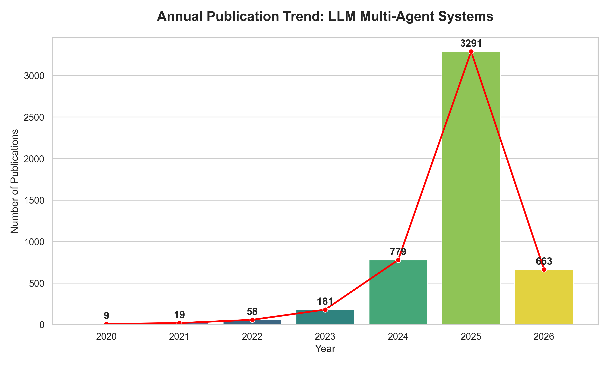
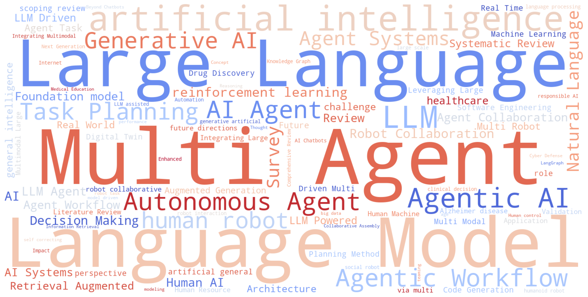

# M1 里程碑：数据采集与质量评估报告

## 1. 文献检索与筛选概况 (PRISMA 流程)
本项目针对大模型多智能体协作领域，在 Lens.org 平台进行了系统性检索。
* **原始检索数 (Identification)**：542 篇
* **去重后数量 (Screening)**：522 篇 (利用 `src/data_quality.py` 自动化去重，去重率 3.69%)
* **数据质量验证**：
    * 标题完整率：100%
    * 摘要覆盖率：98.28%
    * 参考文献覆盖率：81.99% (满足 M2 阶段共被引分析要求)

## 2. 领域发文趋势分析
通过对 522 篇有效文献的年份统计，该领域呈现出显著的指数级增长态势：

**观察结论**：领域自 2023 年起进入爆发期，2025 年发文量（344 篇）比 2024 年增长了 4 倍以上，证明大模型智能体已成为当前 AI 研究的最前沿热点。

## 3. 核心关键词与研究热点分析
通过对文献标题进行词云分析，我们识别出了领域的核心画像：

### 💡 研究热点解读 (M1 Insight)：
通过对 522 篇去重文献标题的词云分析发现，该领域的研究呈现出明显的 **“系统化”**、**“人性化”** 与 **“能力化”** 趋势：

1. **系统化**：以 **Multi-Agent Systems** 为核心，研究重心正从“单个模型”向“复杂任务的协同架构”演进。
2. **人性化**：**Human** 关键词的高度凸显，表明“人机协作” (Human-AI Interaction) 与“人在回路”是当前学术界关注的重中之重。
3. **能力化**：**Autonomous**、**Planning** 与 **Workflow** 的高频出现，印证了智能体正从简单的“文本生成”向具备自主决策能力的“任务执行”快速转型。

## 4. 结论与 M2 计划
本项目 M1 阶段数据准备充分，字段完整度极高，符合文献计量学分析标准。
* **下一阶段目标**：进入 M2 阶段，利用清洗后的数据构建作者共现网络及关键词共现图谱，深度挖掘领域内的核心团队与技术演进路径。
* 
