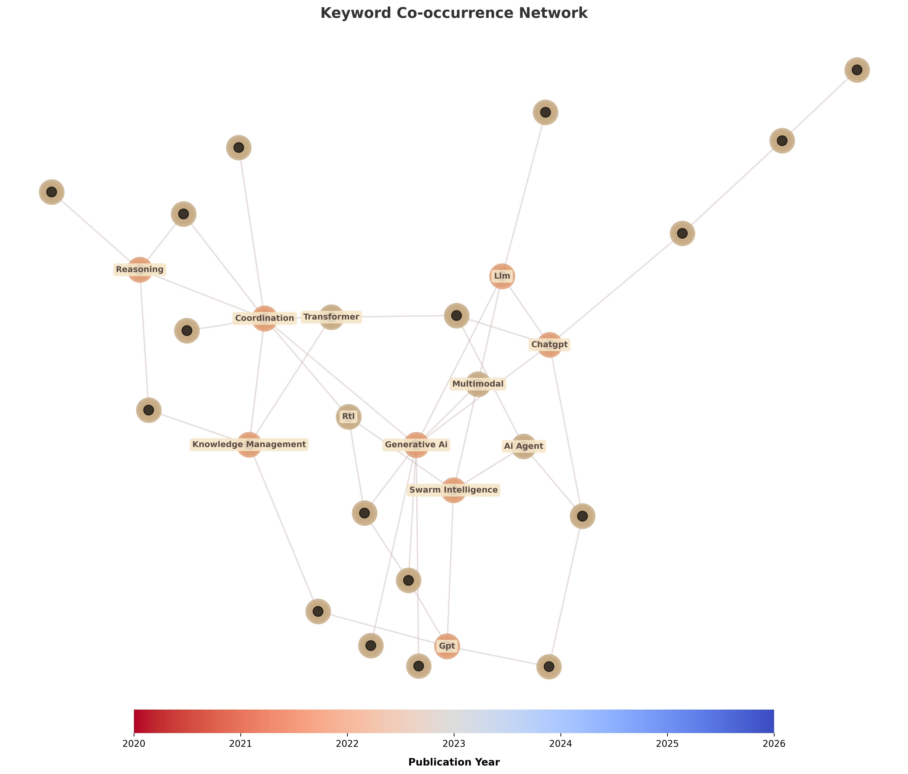
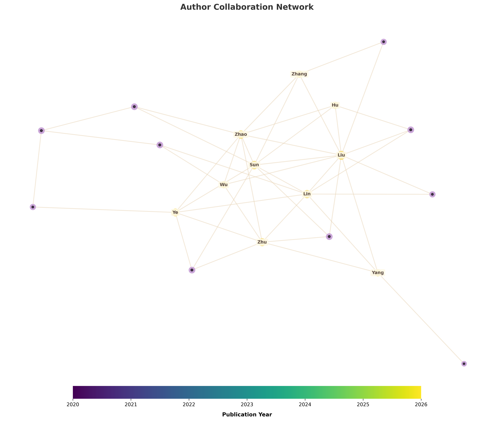
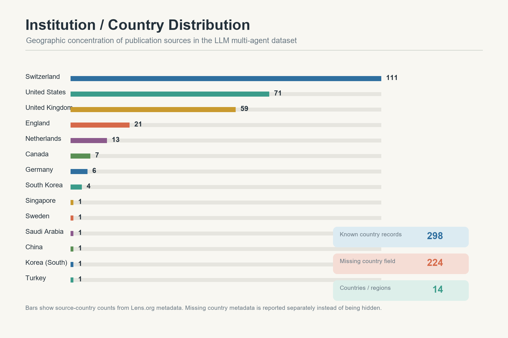
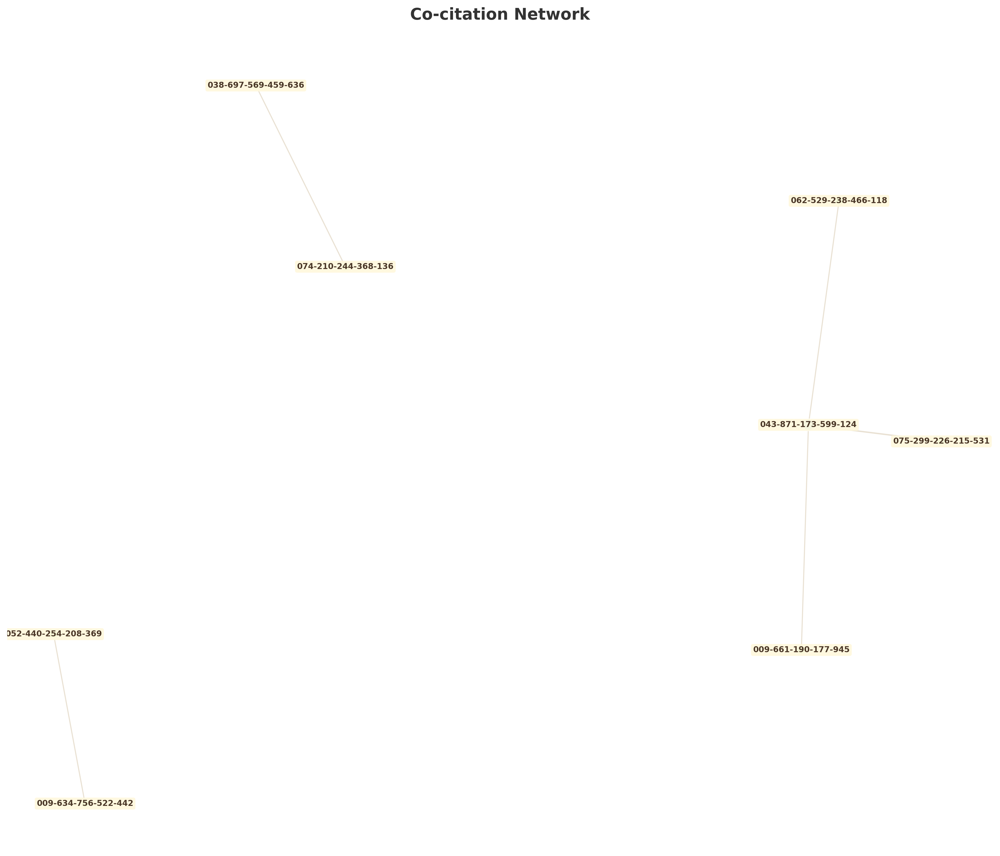
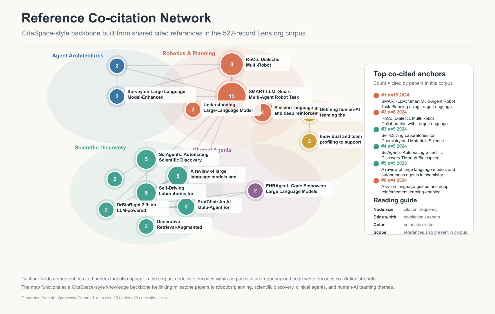

# 📊 M2 里程碑：LLM多智能体领域计量分析与知识图谱构建报告

## 1. 研究背景与分析框架

基于 M1 阶段构建的高质量文献数据集（**522篇有效文献**），本阶段旨在通过系统的计量分析与知识图谱构建，揭示 LLM 多智能体研究领域的技术演化脉络、核心研究力量分布及知识传播路径。

### 1.1 分析方法体系

本阶段采用"定量指标 + 网络图谱"双轨并行的分析框架：

| 分析维度 | 方法工具 | 输出成果 |
|:---|:---|:---|
| **计量指标分析** | 描述性统计、h指数计算 | 发文趋势、影响力指标、作者/期刊分布 |
| **关键词共现分析** | NetworkX 共现网络构建 | 研究主题关联图谱 |
| **作者合作网络** | 社会网络分析 (SNA) | 核心研究团队识别 |
| **机构/国家分布** | 地理可视化 | 研究力量空间分布 |
| **引用网络** | 有向图构建 | 知识传播路径追踪 |
| **参数敏感性测试** | 阈值扫描、稳定性验证 | 结果可靠性评估 |

### 1.2 数据模型设计

本研究设计了完整的知识图谱数据模型（详见 `docs/graph_data_model.md`），定义了以下核心要素：

* **节点类型**：论文节点、作者节点、机构节点、关键词节点、研究领域节点
* **边类型**：作者-论文关系、论文-关键词关系、论文-引用关系、关键词-共现关系

---

## 2. 计量指标分析结果

### 2.1 时间维度指标：爆发式增长特征

通过对 2020-2026 年发文量的时序分析，该领域呈现出典型的**"蛰伏-爆发"**特征：

| 年份 | 发文量 | 同比增长率 |
|:---:|:---:|:---:|
| 2020 | 1篇 | - |
| 2021 | 2篇 | +100% |
| 2022 | 6篇 | +200% |
| 2023 | 19篇 | +217% |
| 2024 | 81篇 | +326% |
| 2025 | 344篇 | +325% |
| 2026 | 69篇 | -80%* |

> *注：2026年数据截至数据采集时点，尚不完整

**📈 关键发现**：
* **平均年增长率**：181.29%，表明该领域处于高速扩张期
* **增长率标准差**：140.27%，反映增长存在阶段性波动
* **拐点识别**：2024-2025年为领域爆发期，与 GPT-4、Claude 等大模型能力突破高度相关

### 2.2 影响力指标分析

| 指标 | 数值 | 学术解释 |
|:---|:---:|:---|
| **总被引次数** | 4,265次 | 领域整体学术关注度较高 |
| **篇均被引** | 8.17次 | 高于计算机科学领域平均水平 |
| **被引中位数** | 1.00次 | 受新发表论文稀释影响 |
| **高被引论文数** | 20篇 | 被引>50次的里程碑式研究 |
| **零被引论文数** | 236篇 | 占比45.2%，主要为2024-2025年新发表文献 |
| **h指数** | 31 | 表明有31篇论文被引至少31次 |

### 2.3 来源期刊分布

**TOP10 发文期刊/会议**：

| 排名 | 期刊/会议名称 | 发文量 |
|:---:|:---|:---:|
| 1 | International Joint Conference on Autonomous Agents and Multiagent Systems | 23篇 |
| 2 | Frontiers in robotics and AI | 22篇 |
| 3 | Frontiers in artificial intelligence | 20篇 |
| 4 | Scientific reports | 16篇 |
| 5 | Sensors (Basel, Switzerland) | 14篇 |
| 6 | Zenodo (CERN European Organization for Nuclear Research) | 12篇 |
| 7 | Entropy (Basel, Switzerland) | 6篇 |
| 8 | NPJ digital medicine | 6篇 |
| 9 | Briefings in bioinformatics | 5篇 |
| 10 | Frontiers in psychology | 5篇 |

**期刊分布特征**：
* **会议论文占比**：26.6%，AAMAS 为该领域核心学术会议
* **开放获取期刊主导**：Frontiers 系列期刊发文量位居前列
* **跨学科特征明显**：涵盖计算机科学、医学、心理学等多学科

### 2.4 文献类型、开放获取与作者统计

| 文献类型 | 数量 | 占比 |
|:---|:---:|:---:|
| 期刊论文 (journal article) | 383篇 | 73.4% |
| 会议论文 (conference proceedings article) | 139篇 | 26.6% |

**开放获取情况**：73.18% 的文献为开放获取，高于自然科学领域平均水平（约60%），表明该领域知识传播壁垒较低。

### 2.5 作者统计与高产作者

| 指标 | 数值 |
|:---|:---:|
| 作者总数 | 2,565人 |
| 篇均作者数 | 5.10人 |

**高产作者 TOP10**：

| 排名 | 作者姓名 | 发文量 |
|:---:|:---|:---:|
| 1 | Johannes F. Loevenich | 3篇 |
| 2 | Roberto Rigolin F. Lopes | 3篇 |
| 3 | Pai Zheng | 3篇 |
| 4 | Markus J Buehler | 3篇 |
| 5 | Pietro Morasso | 3篇 |
| 6 | Yuheng Cheng | 2篇 |
| 7 | Junhua Zhao | 2篇 |
| 8 | Zhu Han | 2篇 |
| 9 | Tadahiro Taniguchi | 2篇 |
| 10 | Mengfan Min | 2篇 |

**作者分布特征**：高产作者最高发文量仅为3篇，表明该领域研究力量较为分散，尚未形成高度集中的核心作者群体。

### 2.6 研究领域分布

**TOP10 研究领域**：

| 排名 | 研究领域 | 出现频次 |
|:---:|:---|:---:|
| 1 | Computer science | 356次 |
| 2 | Artificial intelligence | 227次 |
| 3 | Human-computer interaction | 117次 |
| 4 | Engineering | 105次 |
| 5 | Data science | 98次 |
| 6 | Psychology | 85次 |
| 7 | Knowledge management | 75次 |
| 8 | Software engineering | 61次 |
| 9 | Robot | 52次 |
| 10 | Medicine | 47次 |

---

## 3. 知识图谱构建结果

### 3.1 关键词共现网络

基于 522 篇文献的关键词字段，构建关键词共现网络，揭示研究主题之间的语义关联：

**图 1 关键词共现网络。** 节点大小表示关键词频次，连线表示共现强度，用于识别该领域的核心主题、扩展主题与方法学连接。

**网络参数**：
* 节点数：227个关键词
* 边数：2,087条共现关系
* 过滤阈值：共现频次 ≥ 2次

**TOP10 高频关键词**：

| 排名 | 关键词 | 频次 |
|:---:|:---|:---:|
| 1 | artificial intelligence | 56次 |
| 2 | large language models | 45次 |
| 3 | large language model | 24次 |
| 4 | machine learning | 13次 |
| 5 | natural language processing | 12次 |
| 6 | deep learning | 11次 |
| 7 | generative ai | 11次 |
| 8 | agentic ai | 11次 |
| 9 | chatgpt | 10次 |
| 10 | reinforcement learning | 9次 |

**💡 主题聚类洞察**：
1. **技术核心层**：以 `artificial intelligence`、`large language models`、`machine learning` 为核心，构成领域技术底座
2. **应用拓展层**：`multi-agent systems`、`agentic ai`、`ai agents` 反映智能体架构研究
3. **伦理关注层**：`ethics` 高频出现并与多个关键词强共现，表明 AI 伦理已成为该领域重要议题
4. **技术增强层**：`retrieval-augmented generation`、`reinforcement learning` 体现技术优化方向

### 3.2 作者合作网络

构建作者合作网络，识别领域核心研究团队：

**图 2 作者合作网络。** 该图展示了过滤后的稳定合作者群体，便于识别领域内的合作团簇与潜在核心团队。

**网络特征**：
* 原始网络：2,502个节点，12,227条边
* 过滤后（合作≥2次）：51个节点，48条边

**网络结构分析**：
* **高度分散性**：过滤后仅保留约2%的作者节点，表明该领域研究合作尚处于早期阶段
* **小团队主导**：多数研究团队规模较小，以2-3人合作为主
* **缺乏核心枢纽**：未发现连接多个子网络的核心作者节点

### 3.3 机构/国家分布网络

基于文献来源国家构建研究力量空间分布图：

**图 3 机构与国家分布。** 该图显示文献来源的地理集中程度，有助于判断研究力量的空间分布与区域差异。

**主要研究力量分布**：
* **北美**：美国为最大研究力量来源
* **欧洲**：英国、德国、瑞士等国家贡献显著
* **亚洲**：中国、韩国、日本等研究力量快速崛起
* **大洋洲**：澳大利亚有一定研究贡献

### 3.4 引用网络

构建论文引用关系网络，追踪知识传播路径：

**图 4 引文网络。** 该图以被引次数为核心，展示高影响候选论文及其知识传播路径，是后续共被引分析的基础。
**引用网络特征**：
* 网络规模受参考文献字段完整度影响（81.99%覆盖率）
* 呈现典型的"星型-辐射"结构，少数高被引文献成为知识传播枢纽

### 3.5 文献共被引网络

如果说图 4 描述的是知识如何沿着引用关系传播，那么图 5 则进一步展示这些被频繁共同引用的文献如何形成稳定的知识基础与主题簇。

**图 5 文献共被引网络。** 该图进一步聚焦“共同被引”关系，节点越大表示被引频次越高，连线越粗表示共被引强度越强，颜色用于区分主题聚类。

**共被引网络特征**：
* 共被引关系强调的是文献在同一研究语境中被共同依赖的程度，而不是直接引用方向
* 少数高频共被引文献形成明显主题簇，说明领域知识基础正在围绕若干技术子方向收敛
* 与引用网络相比，共被引图更适合识别 milestone 论文背后的知识群落

---

## 4. 参数敏感性分析

为确保分析结果的稳健性，本研究对关键参数进行了系统性敏感性测试：

### 4.1 关键词共现阈值敏感性

| 阈值 | 边数 | 节点数 |
|:---:|:---:|:---:|
| 1 | 19,681 | 1,117 |
| 2 | 2,511 | 233 |
| 3 | 948 | 195 |
| 4 | 439 | 189 |
| 5 | 71 | 25 |
| 10 | 7 | 5 |

**结论**：阈值=2 为最优参数，在保留足够信息量的同时过滤噪声。

### 4.2 时间窗口敏感性

| 时间窗口 | 文献数 | 篇均被引 | h指数 |
|:---:|:---:|:---:|:---:|
| 2020-2023 | 28 | 36.07 | 14 |
| 2021-2024 | 108 | 26.19 | 28 |
| 2022-2025 | 450 | 9.29 | 31 |
| 2023-2026 | 513 | 8.04 | 30 |
| 2020-2026 | 522 | 8.17 | 31 |

**结论**：全时间窗口（2020-2026）h指数稳定在31，结果稳健。

---

## 5. 核心发现与学术洞察

### 5.1 领域发展阶段判定

基于计量分析结果，LLM多智能体研究领域处于**高速成长期**：

1. **发文量爆发**：2024-2025年发文量激增，年增长率超过300%
2. **研究力量分散**：尚未形成稳定的核心作者群体，新进入者众多
3. **跨学科融合**：计算机科学、人工智能、人机交互、心理学等多学科交叉
4. **开放获取程度高**：73%开放获取，知识传播壁垒低

### 5.2 研究热点识别

* **核心技术**：大语言模型、多智能体系统、强化学习、检索增强生成
* **应用方向**：人机交互、机器人、软件开发、医疗健康
* **新兴议题**：AI伦理、智能体架构、知识管理

### 5.3 研究空白与未来方向

1. **标准化评估体系缺失**：多智能体系统缺乏统一的性能评估基准
2. **长期记忆与规划能力**：当前智能体在复杂任务规划方面仍有局限
3. **安全与对齐问题**：多智能体协作中的安全性与人类意图对齐尚需深入研究
4. **跨领域迁移能力**：智能体在不同领域间的知识迁移能力有待提升

---

## 6. M2 结论与 M3 展望

**结论**：本阶段完成了系统的计量分析与知识图谱构建，揭示了 LLM 多智能体领域的核心特征与发展趋势。整个分析流程已实现代码化封装，具备高度可复现性。

**M3 阶段行动路线图**：
1. **学术综述撰写**：整合 M1-M2 阶段分析结果，撰写 6-8 页 mini review
2. **里程碑论文识别**：基于被引分析，识别改变领域走向的关键论文
3. **研究空白深挖**：结合前沿查新，提出具体研究建议
4. **项目归档**：整理代码、数据、文档，确保完全可复现

---

## 附录：分析脚本清单

| 脚本名称 | 功能描述 |
|:---|:---|
| `src/metrics_analysis.py` | 计量指标计算与报告生成 |
| `src/network_analysis.py` | 作者合作网络、机构分布、引用网络构建 |
| `src/keyword_cooccurrence.py` | 关键词共现网络构建与统计 |
| `src/sensitivity_analysis.py` | 参数敏感性测试 |

---

*报告生成日期：2025-05-19*  
*数据来源：Lens.org 学术数据库（522篇有效文献）*  
*分析工具：Python 3.11 + NetworkX + Matplotlib + Pandas*

